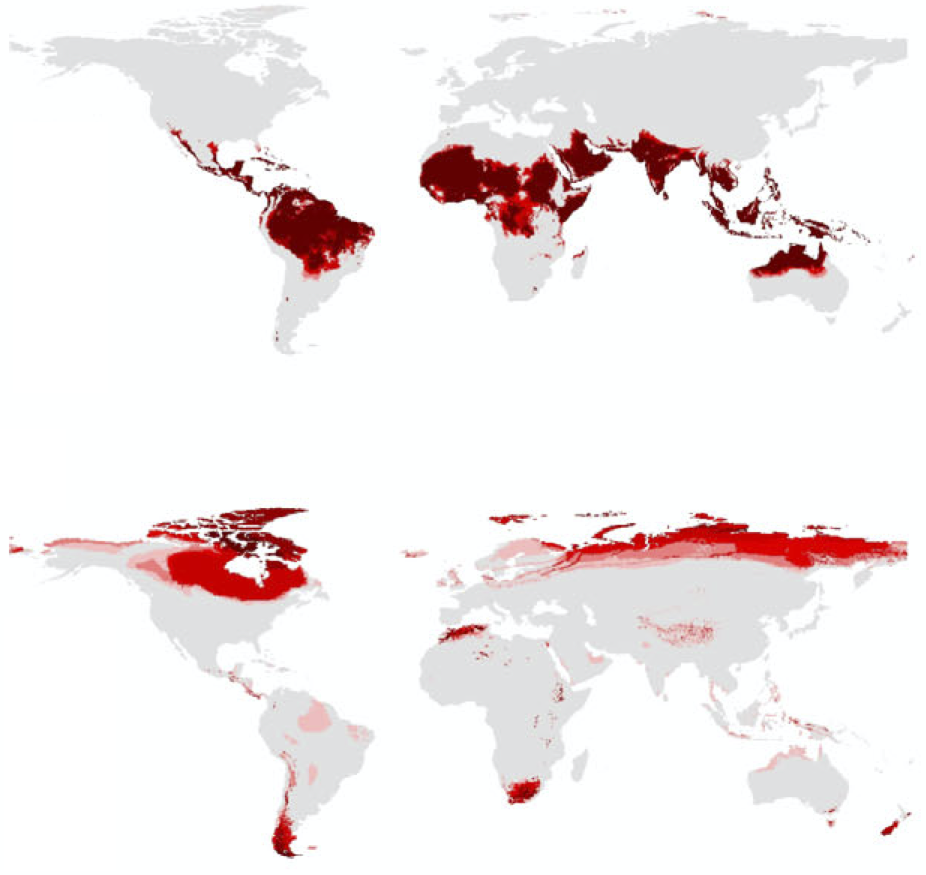



## Ecological speciation and niche evolution

<!--{: width=30% style="float: left"}
does not work-->

* Niche divergence and evolution
* Range evolution
* Geography of speciation
* Local adaptation and population genomics

Sample publications: [*Li et al. 2018 Evolution*](https://doi.org/10.1111/evo.13567), *Li et al.* (under review)

---

### Species coexistence and community assembly

* Co-occurrence patterns over time and space
* Mechanisms of coexistence and assembly
* Environmental gradients and historical contingency
* Species association/network

---

### Biodiversity patterns and biogeographical regionalization

* Floristic structure
* Transition zone
* Environmental correlates
* Taxonomic composition

Sample publications: *Li et al.* (under review)

---

### Global change and species responses

{: width=30% style="float: left"}

* Non-analogous climate patterns
* Range shifts under climate change
* Range limits and niche dynamics
* Changes of biodiversity patterns

Sample publications: [*Li et al. 2018 GCB*](https://doi.org/10.1111/gcb.14104), [*Kou et al. 2014 PLOS One*](https://doi.org/10.1371/journal.pone.0098643), [*Kou et al. 2011 PLOS One*](https://doi.org/10.1371/journal.pone.0023115)

